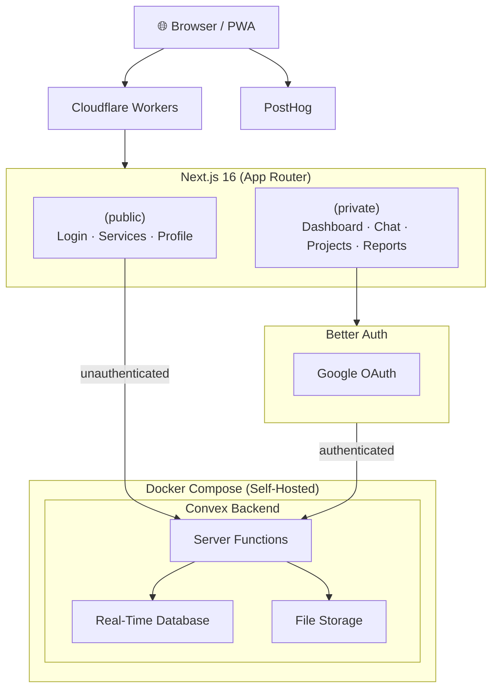

# FabLab Management System

> A full-lifecycle web app for university fabrication labs — from service browsing to job completion.

## Tech Stack

**Frontend**


**Backend & Auth**


**Infrastructure & Observability**


[](#)

**Tooling**


---

## Roles & Permissions

| Role     | Browse Services | Submit Projects | Manage Services | View All Projects | Admin Access |
| -------- | :-------------: | :-------------: | :-------------: | :---------------: | :----------: |
| `client` |       ✅        |       ✅        |       ❌        |        ❌         |      ❌      |
| `maker`  |       ✅        |       ✅        |       ✅        |        ✅         |      ❌      |
| `admin`  |       ✅        |       ✅        |       ✅        |        ✅         |      ✅      |

---

## Roadmap

| Phase                       | Items                                                                |     Status     |
| --------------------------- | -------------------------------------------------------------------- | :------------: |
| **1 · Foundation**          | Auth (email + OAuth), RBAC, role-aware nav                           |    ✅ Done     |
| **2 · Services & Projects** | Service CRUD, project requests, file storage, real-time chat         |    ✅ Done     |
| **3 · Operations**          | Project & inventory tracking, receipts & payments, dashboard widgets | 🔄 In Progress |
| **4 · Analytics & QA**      | Reporting, in-app & PWA notifications, PostHog, Playwright E2E       |   📅 Planned   |

---

## Architecture



---

## Project Structure

```text
src/
  app/
    (public)/         # Login, services listing, profile
    (private)/
      dashboard/
        (manage)/     # Admin/maker: services, reports
        chat/         # Real-time messaging
        projects/     # Project management
convex/
  services/           # Service CRUD
  projects/           # Project lifecycle
  chat/               # Rooms & messages
  notification/       # (planned)
  emails/             # Email helpers
  schema.ts           # Database schema
  auth.ts             # Auth config
  files.ts            # File storage
```

---

## Getting Started

**Prerequisites:** Node.js 18+, [Bun](https://bun.sh/), a [Convex](https://dashboard.convex.dev/) account.

```sh
# 1. Install dependencies
bun install

# 2. Link Convex project (prompts login on first run)
bunx convex dev --until-success

# 3. Configure environment
cp .env.example .env.local

# 4. Start dev server
bun run dev   # → http://localhost:3000
```

## Scripts

| Command                   | Description                                   |
| ------------------------- | --------------------------------------------- |
| `bun run ci`              | Format check, lint, tests, and Next build     |
| `bun run dev`             | Frontend + Convex backend (concurrent)        |
| `bun run build`           | Build Next.js app                             |
| `bun run build:worker`    | Build the OpenNext worker for Cloudflare      |
| `bun run preview`         | Build & preview on Cloudflare Workers locally |
| `bun run deploy`          | Build & deploy to Cloudflare Workers          |
| `bun run deploy:preview`  | Build & deploy the preview worker environment |
| `bun run test`            | Unit tests (watch mode)                       |
| `bun run test:once`       | Unit tests (single run)                       |
| `bun run test:coverage`   | Tests with coverage report                    |
| `bun run lint` / `format` | ESLint / Prettier                             |

## Deployment

The repo now splits deployment into three GitHub Actions workflows:

- **CI** runs `bun run ci:checks` for pull requests and `main`.
- **Preview Deploy** runs on same-repo pull requests, creates a Convex preview deployment, builds the OpenNext worker against that preview, and uploads a `preview` Cloudflare Worker version with a stable PR alias URL.
- **Production Deploy** runs on pushes to `main`, builds against the production Convex deployment, and deploys the default Cloudflare Worker.

Convex is responsible for injecting `NEXT_PUBLIC_CONVEX_URL` and `NEXT_PUBLIC_CONVEX_SITE_URL` at build time, so those values are no longer hardcoded in `wrangler.jsonc`.

Set these GitHub repository secrets before enabling the workflows:

- `CONVEX_PREVIEW_DEPLOY_KEY`
- `CONVEX_PROD_DEPLOY_KEY`
- `CLOUDFLARE_API_TOKEN`
- `CLOUDFLARE_ACCOUNT_ID`

Do **not** set `BETTER_AUTH_URL` in Convex when you want Better Auth to infer the active preview URL from the request. Keep the production OAuth callback URL separate with `BETTER_AUTH_PRODUCTION_URL`, and use `BETTER_AUTH_TRUSTED_ORIGINS` for preview host patterns.

Google OAuth now uses Better Auth's OAuth Proxy so preview and staging deployments can reuse the production Google OAuth app. Configure auth like this across Convex deployments:

- `BETTER_AUTH_PRODUCTION_URL=https://fablab.harleyvan.com`
- `BETTER_AUTH_SECRET=<same value in production and every preview/staging deployment>`
- `BETTER_AUTH_TRUSTED_ORIGINS=<comma-separated preview host patterns, for example *-fablab-preview.acabalharleyvan.workers.dev>`

Register only the production Google callback URL:

```text
https://fablab.harleyvan.com/api/auth/callback/google
```

```sh
# First time only — create isolated OpenNext cache buckets
bunx wrangler r2 bucket create fablab-opennext-cache-prod
bunx wrangler r2 bucket create fablab-opennext-cache-preview
```
